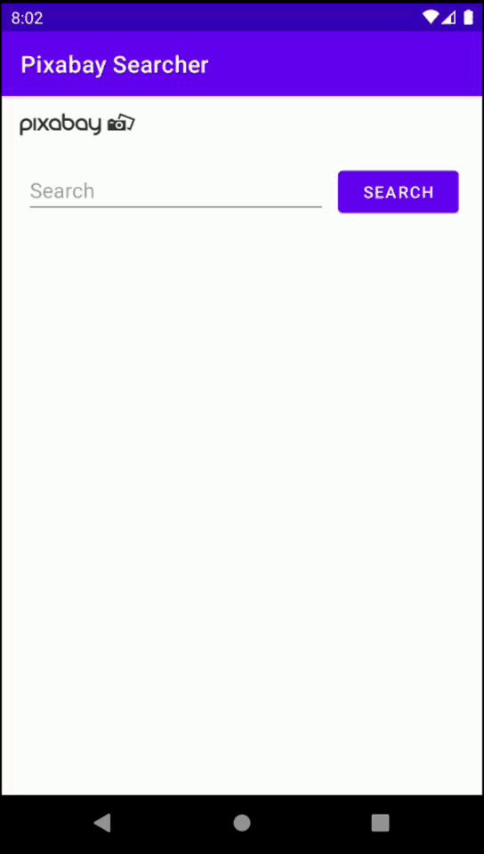

# Pixabay-Searcher

## Table of Contents 
* [About The Project](#about-the-project) 
* [Architecture](#architecture) 
* [Tech](#tech)
* [Contact](#contact) 

## About The Project
An Android application which has been developed with Retrofit, Glide, Data binding and Hilt for practicing.
It simply shows the preview images of search result in [recycler view](https://developer.android.com/guide/topics/ui/layout/recyclerview) as a list using [Pixabay Api](https://pixabay.com/api/docs/).

 

## Architecture
MVVM architecture has been used in the development of this app. 
([ViewModel](https://developer.android.com/topic/libraries/architecture/viewmodel))

## Tech 
* [Coroutines](https://developer.android.com/kotlin/coroutines) - To execute asynchronous tasks.
* [Data Binding](https://developer.android.com/topic/libraries/data-binding)
* [Glide](https://github.com/bumptech/glide) - To load images into ImageViews.
* [Hilt](https://developer.android.com/training/dependency-injection/hilt-android) - Automatized dependency injection library.
* [Hilt](https://dagger.dev/hilt/) - Hilt documentation on dagger.dev.
* [Moshi](https://github.com/square/moshi/) - JSON library to parse JSON.
* [Retrofit](https://square.github.io/retrofit/) - To make HTTP requests.
* [ViewModel](https://developer.android.com/jetpack/androidx/releases/lifecycle) - Link for ViewModel dependencies.

## Contact
[ensertyazilim@gmail.com](#)
